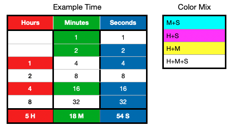

# RGB Binary Clock for Arduino (Legacy, 12 hour format)
This repository contains my RGB Binary Clock project for the Arduino Nano, originally created about 10 years ago.

The hardware setup is minimal: Arduino Nano, 6 RGB LEDs, resistors and a switch.

The project includes basic time output via the serial interface at 9600 baud.

Pins are easily configurable for additional LEDs in the following arrays: `hourLEDs[]`, `minuteLEDs[]`, `secondLEDs[]` and `loopLEDs[]`.

A switch is used to accelerate time for setting purposes.

The project relies on the Arduino Time library by Michael Margolis:
[https://github.com/PaulStoffregen/Time](https://github.com/PaulStoffregen/Time)

Using the Arduino Library Manager, install "*Time* by *Michael Margolis*".

## How does it actually work?
6 RGB LEDs. Each RGB LED represents a combination of hours, minutes and seconds.

Each RGB LED has three colors: red, green and blue. By mixing these colors, you can create CMY colors.

The **1st and 2nd LEDs** can only represent minutes and seconds.

For example, in the table above, the LED colors correspond to a specific time:
1. Green
2. Cyan
3. Magenta
4. Off
5. White
6. Blue

## How to read it

**Red** = hours

**Green** = minutes

**Blue** = seconds

Understanding color combinations lets you read the time visually.

The **LEDs**, starting from the first (top) one, represent binary values: 1, 2, 4, 8, 16, 32 for minutes and seconds.

Hours start from the **3rd LED**: 1, 2, 4, 8.

You can physically rearrange the LEDs or adjust it in the code.

For full functionality, you could add a **DS3231/DS1307 module** and [DS1307RTC library][1] or another real-time clock to keep accurate time.

[1]:<https://github.com/PaulStoffregen/DS1307RTC>

## License 📄

[MIT](LICENSE)
